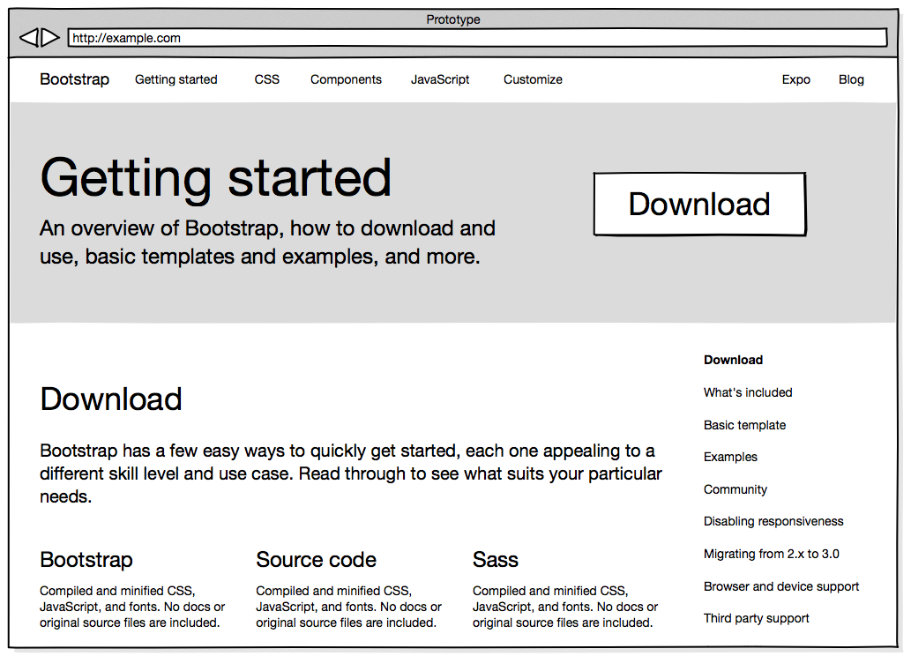

**NOTE: This project is old, incomplete and currently abandoned. In lieu of somebody taking over this and doing a lot of work, this project should be considered defunct, and is only here for the purposes of sharing. Read the [Project status](#project-status) section for more details.**

# Prototype

A Mac app for creating mockups.

[Download an alpha build of Prototype.](https://github.com/mkdynamic/prototype/releases/download/alpha/Prototype.Alpha.zip)

## Sample

Here is a sample export produced by the app as [PNG](Samples/export.png) and as [PDF](Samples/export.pdf).

## Motivation

There are many great apps for building mockups of web and iOS apps. When I started building Prototype, there were no native apps that produced vector output. That may or may not still be true.

Prototype was an attempt to build a speedy and native mockup tool. It is important to me that mockups look “nice”. Rough, but not shitty. In particular, that means vector output and not low resolution raster images.

Since the output of Prototype is vector, printed mockups look sharp and can scale to any size. It also makes it easy to export mockups to PDF format, since the drawing system is based on Quartz. Typography uses native CoreText, and so can (potentially) be accurate and legible.

## Project status

The code ranges from bad to terrible. I started this project to scratch an itch and also to learn Objective-C. I no longer have the time to continue with it, so would love somebody to take it over. It needs a lot of design and code to get into a good state.

If somebody wants to revive it, great. If not, hopefully there is some interesting/useful/hilarious code in here :)

## Features

- Undo/redo stack
- Full text support, with a Markdown subset supported
- File saving and loading
- Printing
- Export to PDF/PNG
- Layout tools (align, distribute, space)
- Group/ungroup
- Smart guides
- Grid
- Snap to guides, snap to grid
- Zoom
- Cut/copy/paste/duplicate
- Nudge (keyboard commands)
- Opacity
- Basic widget library

## Known issues

- Code was written with GC (now deprecated). Needs converting to ARC.
- Performance is mixed, but mostly not great.
- Some features are not finished.
- Some featured are missing.
- Some features are buggy.
- Dragged widget from sidebar sometimes gets ‘stuck’.
- It’s easy to loose focus of main view (should always be focused unless you’re in a text input).

There are probably many other problems.

## Ideas

- Add more widgets
- Guides and grid need cleanup and UX refinements
- Needs good icon library
- Needs nice font
- Performance optimizations
- Visual design throughout
- Allow marquee selection outside
- Better image ‘sketch’ filter
- Change properties on groups should propagate
- Strike through for text -A- > greyed out ‘A’
- Add alt. keyboard shortcuts from illustrator/fireworks/photoshop for layout items
- App icon
- Export to cloudapp

## Acknowledgements

- Open source projects, snippets, blog posts, tutorials, not limited to:
  - https://github.com/jacobx/thoughtkit
  - https://github.com/adamwulf/DrawKit
  - https://github.com/indragiek/INAppStoreWindow
  - https://github.com/jnozzi/JLNDragEffectManager
  - https://github.com/jfahrenkrug/VertexHelper
  - https://github.com/glebd/bwtoolkit
- [*Mimicking hand-drawn pencil lines*](http://dl.acm.org/citation.cfm?id=2381346) by Meraj, Zainab and Wyvill, Brian and Isenberg, Tobias and Gooch, Amy A. and Guy, Richard
- Balsamiq and Mockingbird for inspiration.
- Adobe Creative Suite for layout patterns and keyboard combos inspiration.

If any credits are missing, please let me know, and I will add them.

## License

Copyright © 2014 Mark Dodwell.

Permission is hereby granted, free of charge, to any person obtaining a copy of this software and associated
documentation files (the “Software”), to deal in the Software without restriction, including without limitation the
rights to use, copy, modify, merge, publish, distribute, sublicense, and/or sell copies of the Software, and to
permit persons to whom the Software is furnished to do so, subject to the following conditions:

The above copyright notice and this permission notice shall be included in all copies or substantial portions of the
Software.

THE SOFTWARE IS PROVIDED “AS IS”, WITHOUT WARRANTY OF ANY KIND, EXPRESS OR IMPLIED, INCLUDING BUT NOT LIMITED TO THE
WARRANTIES OF MERCHANTABILITY, FITNESS FOR A PARTICULAR PURPOSE AND NONINFRINGEMENT. IN NO EVENT SHALL THE AUTHORS OR
COPYRIGHT HOLDERS BE LIABLE FOR ANY CLAIM, DAMAGES OR OTHER LIABILITY, WHETHER IN AN ACTION OF CONTRACT, TORT OR
OTHERWISE, ARISING FROM, OUT OF OR IN CONNECTION WITH THE SOFTWARE OR THE USE OR OTHER DEALINGS IN THE SOFTWARE.
